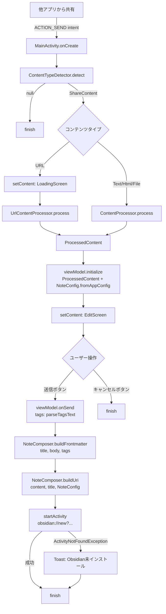
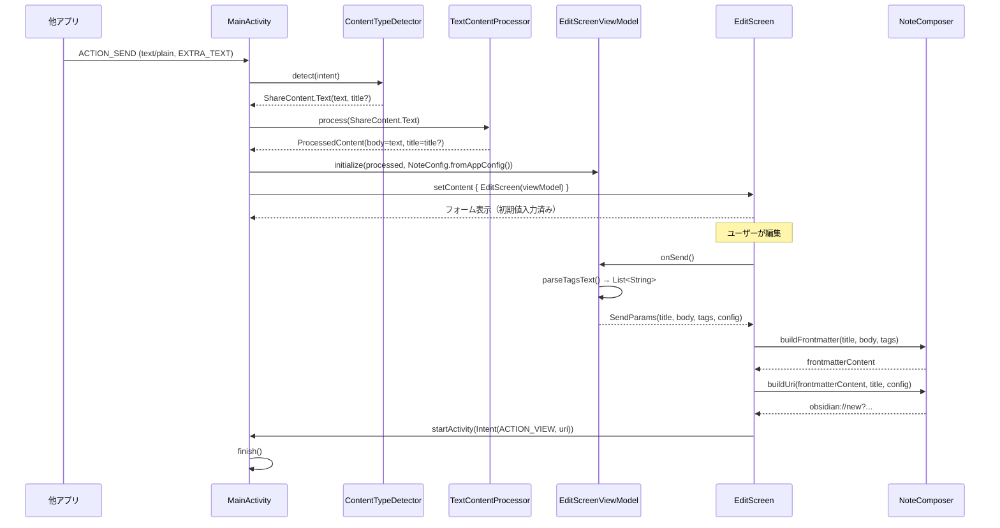
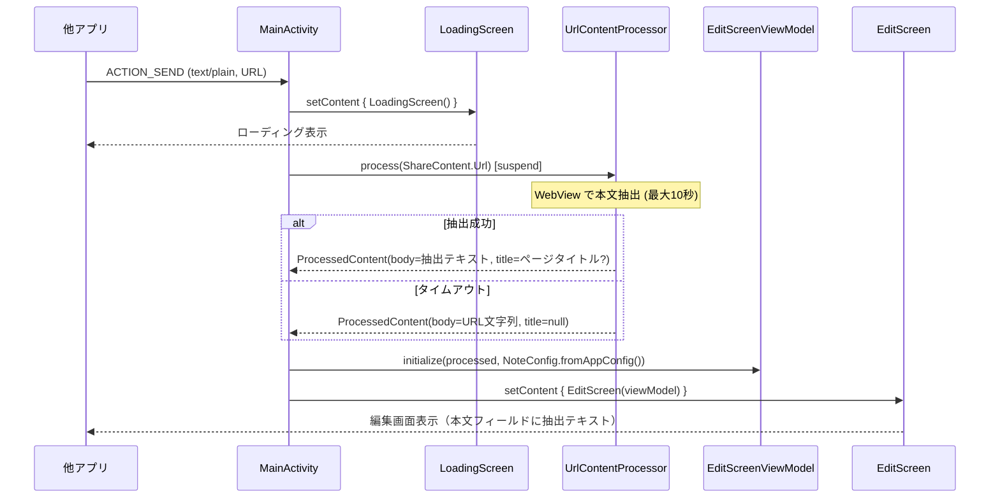
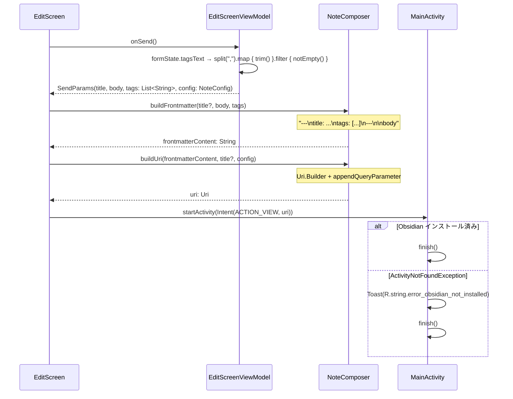
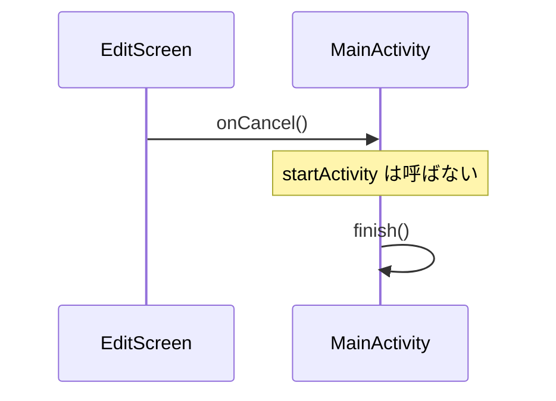
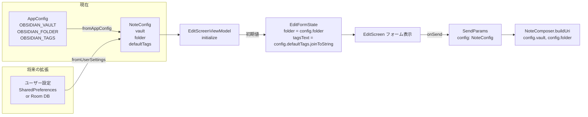
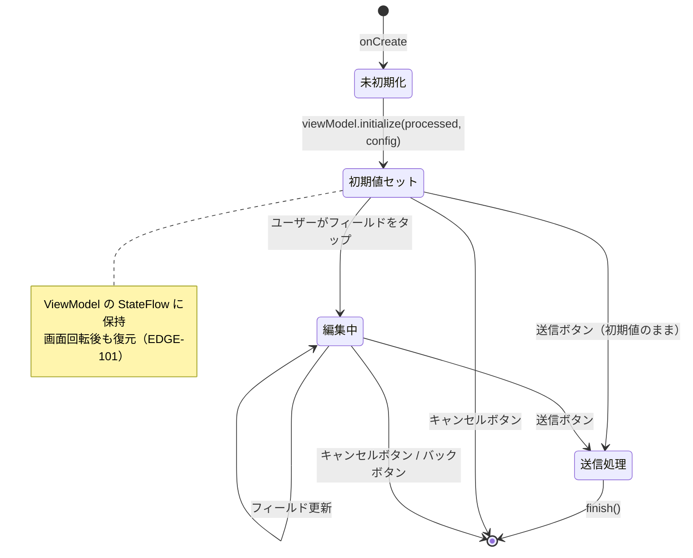

# 展開内容の編集・プレビュー機能 データフロー図

**作成日**: 2026-03-29
**関連アーキテクチャ**: [architecture.md](architecture.md)
**関連要件定義**: [requirements.md](../../spec/content-edit-preview/requirements.md)

**【信頼性レベル凡例】**:
- 🔵 **青信号**: 要件定義書・ユーザヒアリングを参考にした確実なフロー
- 🟡 **黄信号**: 要件定義書・ユーザヒアリングから妥当な推測によるフロー
- 🔴 **赤信号**: 要件定義書・ユーザヒアリングにない推測によるフロー

---

## システム全体のデータフロー 🔵

**信頼性**: 🔵 *REQ-001, REQ-101, REQ-201, REQ-301・既存設計より*



---

## フロー1: テキスト共有時 🔵

**信頼性**: 🔵 *REQ-001, REQ-003・ユーザストーリー1.1より*

**関連要件**: REQ-001, REQ-003, REQ-101



**詳細ステップ**:
1. `EXTRA_TEXT` → `TextContentProcessor.process()` → `ProcessedContent(body=text, title=EXTRA_SUBJECT?)`
2. `viewModel.initialize()` で `EditFormState` の初期値をセット
3. `EditScreen` が初期値入力済みのフォームを表示
4. 送信時: `tagsText` をカンマ区切りパース → `NoteComposer` 経由で Frontmatter + URI 生成

---

## フロー2: URL共有時 🔵

**信頼性**: 🔵 *REQ-301・ユーザストーリー1.2・ユーザヒアリングより*

**関連要件**: REQ-001, REQ-301, REQ-302



**詳細ステップ**:
1. URL受信直後に `LoadingScreen` を表示（既存動作）
2. `UrlContentProcessor` が WebView で本文抽出（タイムアウト: 10秒）
3. タイムアウト時は URL 文字列をそのまま body に設定（REQ-302 フォールバック）
4. 完了後 `LoadingScreen` → `EditScreen` に置き換え

---

## フロー3: 送信ボタンタップ 🔵

**信頼性**: 🔵 *REQ-101, REQ-103・ユーザストーリー2.1/2.2より*

**関連要件**: REQ-101, REQ-102, REQ-103



**タグパース仕様** (REQ-103):
```
入力: "shared,  web , clipping "
分割: ["shared", "  web ", " clipping "]
trim: ["shared", "web", "clipping"]
空除去: ["shared", "web", "clipping"]
出力: tags: [shared, web, clipping]
```

**エッジケース**:
- 空文字 `""` → `[]` → `tags: []` (EDGE-003)
- カンマのみ `","` → `["", ""]` → trim/filter → `[]` → `tags: []`

---

## フロー4: キャンセルボタンタップ 🔵

**信頼性**: 🔵 *REQ-201・ユーザストーリー1.4より*

**関連要件**: REQ-201



---

## NoteConfig データフロー 🔵

**信頼性**: 🔵 *ユーザヒアリング（将来のユーザー設定）・REQ-405より*



**設計意図**: `NoteConfig` は現在 `AppConfig` の値をそのまま使用するが、将来的にユーザーが vault・folder・defaultTags を設定できるようにする際の拡張ポイントとなる。`EditScreenViewModel` は `NoteConfig` を受け取るため、設定ソースが変わっても ViewModel の実装変更は最小限で済む。

---

## EditFormState 状態変化 🔵

**信頼性**: 🔵 *REQ-003, REQ-101・EDGE-101より*



---

## 関連文書

- **アーキテクチャ**: [architecture.md](architecture.md)
- **Kotlinインターフェース**: [interfaces.kt](interfaces.kt)
- **要件定義**: [requirements.md](../../spec/content-edit-preview/requirements.md)
- **既存データフロー**: [share-content-expansion/dataflow.md](../share-content-expansion/dataflow.md)

## 信頼性レベルサマリー

- 🔵 青信号: 8件 (89%)
- 🟡 黄信号: 1件 (11%)
- 🔴 赤信号: 0件 (0%)

**品質評価**: 高品質
