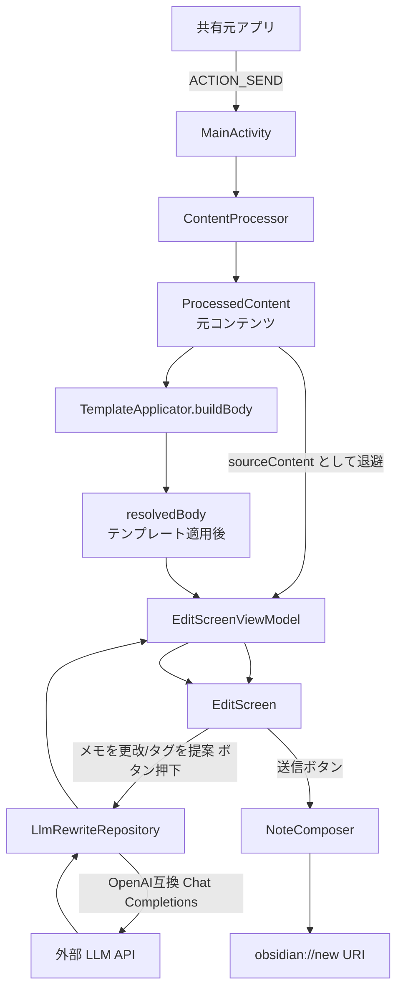
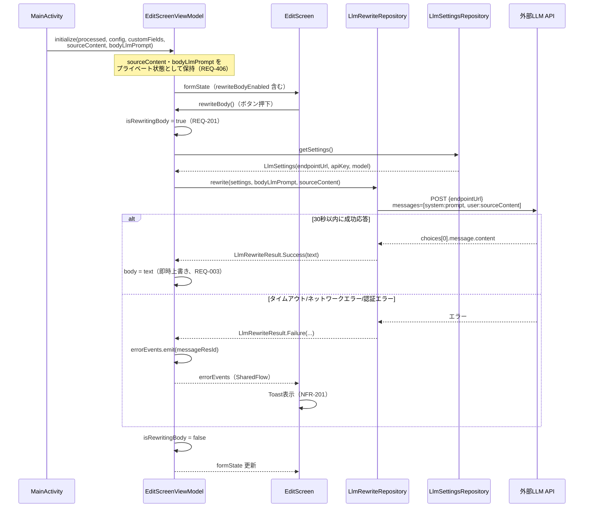
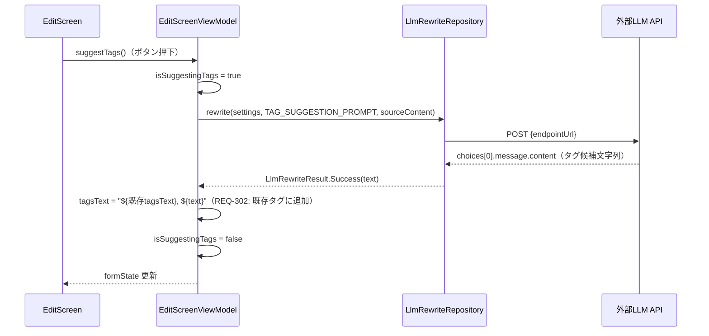
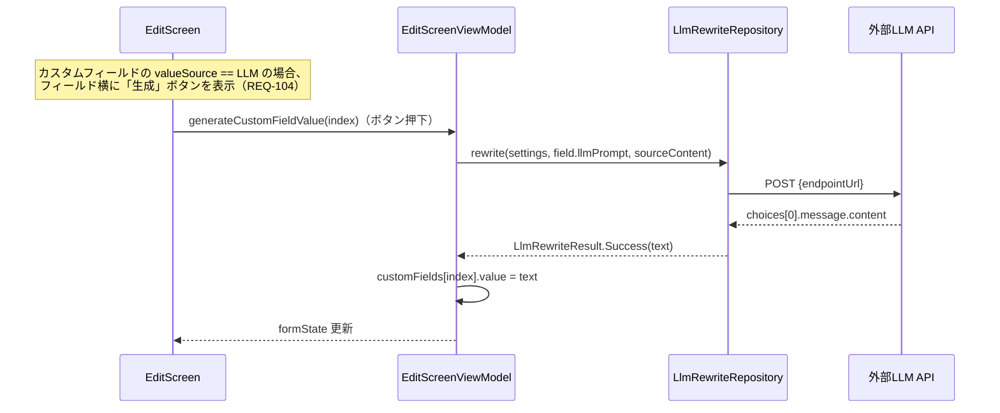
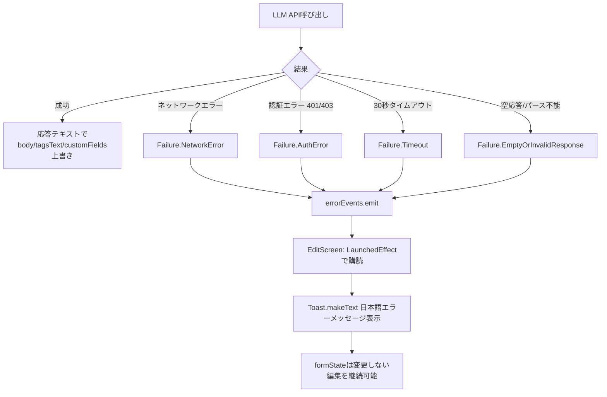
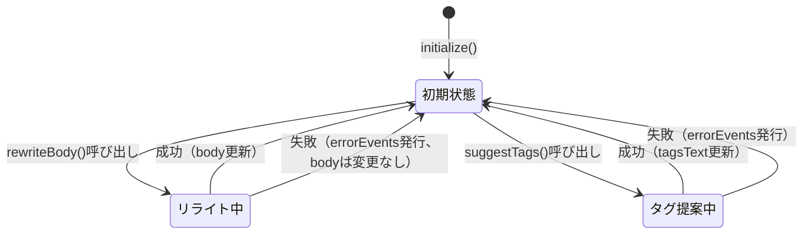

# LLMによるメモ更改機能の追加 データフロー図

**作成日**: 2026-07-05
**関連アーキテクチャ**: [architecture.md](architecture.md)
**関連要件定義**: [requirements.md](../../spec/llm-memo-rewrite/requirements.md)

**【信頼性レベル凡例】**:
- 🔵 **青信号**: EARS要件定義書・設計文書・ユーザヒアリングを参考にした確実なフロー
- 🟡 **黄信号**: EARS要件定義書・設計文書・ユーザヒアリングから妥当な推測によるフロー
- 🔴 **赤信号**: EARS要件定義書・設計文書・ユーザヒアリングにない推測によるフロー

---

## システム全体のデータフロー 🔵

**信頼性**: 🔵 *requirements.md・既存 MainActivity 実装より*

---

## 主要機能のデータフロー

### 機能1: 本文のLLMリライト（Must Have） 🔵

**信頼性**: 🔵 *ユーザーストーリー1.1・受け入れ基準TC-001・REQ-002・REQ-406より*

**関連要件**: REQ-001, REQ-002, REQ-003, REQ-201, REQ-202, REQ-406

**詳細ステップ**:
1. `MainActivity` は `ContentProcessor` の結果 `ProcessedContent.body`（テンプレート適用前）を `sourceContent` として退避する（REQ-406）
2. `EditScreenViewModel.initialize()` に `sourceContent` とテンプレートの `bodyLlmPrompt` を渡し、ViewModel内部のプライベート状態として保持する
3. ユーザーが「メモを更改」ボタンを押すと `rewriteBody()` が呼ばれ、`sourceContent`（EditScreen上で編集済みの `formState.body` ではない）を入力としてLLM APIを呼び出す
4. 成功時は応答テキストで `formState.body` を即時上書きする（REQ-003）。失敗時は `errorEvents` 経由でEditScreenがToast表示する（NFR-201）

---

### 機能2: タグ提案（Should Have） 🔵

**信頼性**: 🔵 *ユーザーストーリー2.1・REQ-301・REQ-302より*

**関連要件**: REQ-103, REQ-301, REQ-302, REQ-406

**詳細ステップ**:
1. 入力は本文リライトと同一の `sourceContent`（REQ-302, REQ-406）
2. アプリ内固定のタグ提案用プロンプト（`TAG_SUGGESTION_PROMPT`）を使用する 🟡（テンプレート単位のカスタムプロンプトは要件上明示されていないための設計判断。design-interview.md「残課題」参照）
3. 生成結果は既存の `tagsText` に追加する（置換ではない）

**備考**: タグ提案用プロンプトをテンプレート単位でカスタマイズ可能にするかどうかは、Should Have の実装着手前に再確認を推奨（design-interview.md 残課題）。

---

### 機能3: カスタムフィールドのLLM生成（Could Have） 🟡

**信頼性**: 🟡 *REQ-104・REQ-303・REQ-304から妥当な推測（生成タイミングは設計時点で確定した仮決定）*

**関連要件**: REQ-104, REQ-303, REQ-304

**備考**: `TemplateApplicator.buildCustomFields()` の時点（MainActivity起動時）では `FieldValueSource.LLM` のフィールドは空文字で初期化し、実際の値生成はEditScreen上のボタン押下時に行う設計とした（REQ-304の生成タイミングをbody/tagsと統一する設計判断。design-interview.md 残課題参照）。

---

## データ処理パターン

### 同期処理 🔵

**信頼性**: 🔵 *既存アーキテクチャより*

- `TemplateApplicator.buildBody()`/`buildCustomFields()` はMainActivity起動時に同期的に実行（既存パターン、LLM呼び出しは含まない）

### 非同期処理 🔵

**信頼性**: 🔵 *REQ-201, REQ-202より*

- LLM API呼び出し（`rewriteBody()`, `suggestTags()`, `generateCustomFieldValue()`）はすべて `viewModelScope.launch` 内の非同期処理として実行
- 30秒タイムアウトは `HttpTimeout` プラグイン（Ktor）が担当し、`HttpRequestTimeoutException` を捕捉して `LlmRewriteResult.Failure.Timeout` に変換する

---

## エラーハンドリングフロー 🔵

**信頼性**: 🔵 *EDGE-001〜004, NFR-201より*

---

## 状態管理フロー

### EditScreenViewModel の状態遷移 🔵

**信頼性**: 🔵 *REQ-201, REQ-202・既存 EditScreenViewModel 実装パターンより*

---

## 関連文書

- **アーキテクチャ**: [architecture.md](architecture.md)
- **型定義**: [interfaces.kt](interfaces.kt)
- **DBスキーマ**: [database-schema.kt](database-schema.kt)
- **外部API連携仕様**: [api-endpoints.md](api-endpoints.md)

## 信頼性レベルサマリー

- 🔵 青信号: 14件 (82%)
- 🟡 黄信号: 3件 (18%)
- 🔴 赤信号: 0件 (0%)

**品質評価**: ✅ 高品質
