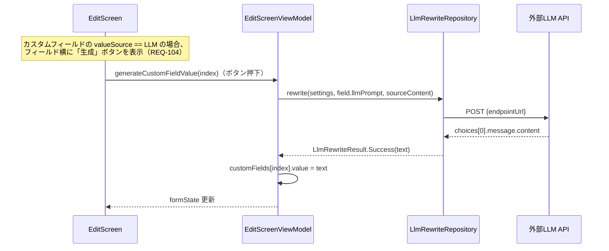

# TASK-0072 TDD開発コンテキスト

**タスクID**: TASK-0072  
**機能名**: llm-memo-rewrite（EditScreenViewModel generateCustomFieldValue()・EditScreen UI「生成」ボタン追加）  
**タスク概要**: `EditScreenViewModel`に`generateCustomFieldValue(index: Int)`を追加し、`customFields[index].valueSource == FieldValueSource.LLM`のフィールドについてLLM呼び出しを行い、該当インデックスの値のみを更新する。`EditScreen`のカスタムフィールド表示部分に、`valueSource == LLM`の場合のみ「生成」ボタンを表示する。

**推定工数**: 6時間  
**フェーズ**: Phase 6 - カスタムフィールドのLLM生成（Could Have）

---

## 1. 技術スタック

### Kotlin & Android標準
- **言語**: Kotlin 2.2.10
- **AGP**: 9.2.1
- **SDK**: minSdk 33 (Android 13), targetSdk/compileSdk 36
- **参照元**: gradle/libs.versions.toml

### UIフレームワーク
- **Jetpack Compose**: BOM 2024.09.00
- **Material3**: androidx.compose.material3（既存パターン踏襲）
- **参照元**: gradle/libs.versions.toml, 既存 EditScreen.kt

### アーキテクチャ・DI
- **MVVM + Repository**: ViewModel + MutableStateFlow
- **DI**: Hilt 2.59.2（@HiltViewModel, @Inject）
- **参照元**: app/src/main/java/com/den4dr/share2Obsidian/ui/EditScreenViewModel.kt

### テスト
- **単体テスト**: JUnit 4.13.2
- **Mock**: MockK 1.13.12
- **Coroutines Test**: kotlinx-coroutines-test 1.9.0（StandardTestDispatcher, runTest, advanceUntilIdle）
- **テストランナー**: Robolectric（RobolectricTestRunner）
- **参照元**: app/src/test/java/com/den4dr/share2Obsidian/ui/EditScreenViewModelRewriteBodyTest.kt

### HTTP・LLM連携
- **HTTP Client**: Ktor Client (CIO エンジン)
- **シリアライズ**: kotlinx-serialization
- **タイムアウト**: HttpTimeout プラグイン（30秒）
- **参照元**: app/src/main/java/com/den4dr/share2Obsidian/data/llm/LlmRewriteRepositoryImpl.kt

---

## 2. 開発ルール

### Kotlin コーディング規約
- **StateFlow パターン**: `private val _uiState = MutableStateFlow<State>()`, `val uiState: StateFlow<State> = _uiState.asStateFlow()` 形式
- **状態更新**: `_formState.update { it.copy(...) }` で不可変更新
- **ViewModel Coroutine**: `viewModelScope.launch` でバックグラウンド処理
- **参照元**: EditScreenViewModel.kt の既存パターン

### UI/Compose パターン
- **テストタグ**: `testTag` で UI要素を識別
- **アイコンボタン**: `IconButton` で生成ボタンを表示
- **ラベル**: `stringResource(R.string.xxx)` で文字列リソース参照
- **参照元**: 既存 EditScreen.kt の実装

### テストケース設計
- **テストメソッド名規約**: `generateCustomFieldValue_{期待結果}()` パターン
- **Arrange-Act-Assert**: Given-When-Then（AAA）パターン
- **MockK**: `coEvery {}, coVerify {}` で非同期関数をテスト
- **SharedFlow 購読**: `collectErrorEvents()` ヘルパーで errorEvents を先行購読
- **スケジューラ共有**: `StandardTestDispatcher` を Dispatchers.Main と runTest() に明示的に渡す
- **参照元**: EditScreenViewModelRewriteBodyTest.kt の既存テストケース

---

## 3. 関連実装

### 既存の EditScreenViewModel パターン（rewriteBody/suggestTags を参考）

```kotlin
// 現在の EditFormState（TASK-0072で拡張予定）
data class EditFormState(
    val vault: String = "",
    val title: String,
    val body: String,
    val tagsText: String,
    val folder: String,
    val customFields: List<CustomFieldState> = emptyList(),
    val isRewritingBody: Boolean = false,
    val rewriteBodyEnabled: Boolean = false,
    val isSuggestingTags: Boolean = false,
    // TASK-0072で追加: 個別フィールド生成中のローディング状態
    // val generatingFieldIndex: Int? = null,  // 生成中のフィールドインデックス（null=生成中でない）
)

// CustomFieldState の構造
data class CustomFieldState(
    val key: String,
    val value: String,
    val valueType: FieldValueType,
    val valueSource: FieldValueSource = FieldValueSource.FIXED,  // LLM生成ボタン表示判定に使用
    val llmPrompt: String = "",  // LLM呼び出し用プロンプト
)
```

### rewriteBody() の実装パターン（generateCustomFieldValue の参考）

```kotlin
fun rewriteBody() {
    viewModelScope.launch {
        runLlmRequest(
            prompt = bodyLlmPrompt,
            setLoading = { loading -> _formState.update { it.copy(isRewritingBody = loading) } },
            onSuccess = { text -> _formState.update { it.copy(body = text) } },
        )
    }
}

// ヘルパー関数：ローディング開始→設定取得→LLM呼び出し→成功/失敗分岐→ローディング終了
private suspend fun runLlmRequest(
    prompt: String,
    setLoading: (Boolean) -> Unit,
    onSuccess: (String) -> Unit,
) {
    setLoading(true)
    val settings = llmSettingsRepository.getSettings().first()
    when (val result = llmRewriteRepository.rewrite(settings, prompt, sourceContent)) {
        is LlmRewriteResult.Success -> onSuccess(result.text)
        is LlmRewriteResult.Failure -> _errorEvents.emit(result.messageResId)
    }
    setLoading(false)
}
```

### 既存の updateCustomField パターン

```kotlin
fun updateCustomField(index: Int, value: String) {
    val fields = _formState.value.customFields.toMutableList()
    if (index in fields.indices) {
        fields[index] = fields[index].copy(value = value)
        _formState.value = _formState.value.copy(customFields = fields)
    }
}
```

**参照元**: app/src/main/java/com/den4dr/share2Obsidian/ui/EditScreenViewModel.kt

### 既存テストケース（rewriteBody パターン）

```kotlin
@Test
fun rewriteBody_updatesFormStateBodyOnSuccess() {
    val viewModel = createViewModel()
    coEvery { mockRewrite.rewrite(any(), any(), any()) } 
        returns LlmRewriteResult.Success("生成結果")

    viewModel.rewriteBody()
    advanceUntilIdle()

    assertEquals("生成結果", viewModel.formState.value.body)
}

@Test
fun rewriteBody_emitsErrorEventOnFailure() {
    val viewModel = createViewModel()
    coEvery { mockRewrite.rewrite(any(), any(), any()) } 
        returns LlmRewriteResult.Failure.NetworkError(R.string.error_llm_network)
    
    val (received, job) = collectErrorEvents(viewModel)
    viewModel.rewriteBody()
    advanceUntilIdle()
    job.cancel()

    assertTrue(received.contains(R.string.error_llm_network))
}
```

**参照元**: app/src/test/java/com/den4dr/share2Obsidian/ui/EditScreenViewModelRewriteBodyTest.kt

---

## 4. 設計文書

### 要件定義（REQ-104, REQ-303, REQ-304）

| 要件ID | 説明 | 信頼性 |
|--------|------|--------|
| REQ-104 | カスタムフィールドのLLM生成（Could Have）が有効な場合、システムはテンプレート編集画面で当該フィールド用のプロンプト入力欄を表示しなければならない | 🔵 |
| REQ-303 | システムはカスタムフィールドの値取得方法（`FieldValueSource`）に `LLM` を追加してもよい（Could Have） | 🔵 |
| REQ-304 | `FieldValueSource` が `LLM` に設定されたカスタムフィールドについて、システムはテンプレート適用時にLLMで値を生成してもよい | 🟡 |

**参照元**: docs/spec/llm-memo-rewrite/requirements.md

### 機能3: カスタムフィールドのLLM生成（Could Have） 🟡

**信頼性**: 🟡 *REQ-104・REQ-303・REQ-304から妥当な推測（生成タイミングはEditScreen上のボタン押下時）*

**関連要件**: REQ-104, REQ-303, REQ-304



**データフロー詳細**:
1. EditScreen上のカスタムフィールドの「生成」ボタン（LLM値取得元のみ表示）をユーザーが押す
2. EditScreenViewModel の `generateCustomFieldValue(index)` が呼び出される
3. ViewModel は該当フィールドの `llmPrompt` を取得し、`sourceContent` を入力としてLLM APIを呼び出す
4. 成功時は応答テキストで `customFields[index].value` のみを上書きする（他フィールドに影響しない）
5. 失敗時は `errorEvents` でEditScreenがToast表示する

**参照元**: docs/design/llm-memo-rewrite/dataflow.md（機能3）

### アーキテクチャ設計

**EditScreenViewModel への変更**:

| 項目 | 変更内容 | 対応要件 |
|------|---------|---------|
| `generateCustomFieldValue(index: Int)` メソッド追加 | 該当インデックスのカスタムフィールドに対してLLM値を生成 | REQ-304 |
| `EditFormState` に `generatingFieldIndex: Int?` 追加（オプション）| 個別フィールド生成中の UI表示用（ローディング） | REQ-201（拡張） |

**EditScreen への変更**:

| 項目 | 変更内容 | 対応要件 |
|------|---------|---------|
| カスタムフィールド表示ループへ「生成」ボタン追加 | `valueSource == LLM` の場合のみ表示 | REQ-104 |
| ボタンクリック時の処理 | `viewModel.generateCustomFieldValue(index)` を呼び出す | REQ-304 |

**参照元**: docs/design/llm-memo-rewrite/architecture.md

### 実装詳細（TASK-0072.md より）

**`generateCustomFieldValue(index: Int)` 実装**:

```kotlin
fun generateCustomFieldValue(index: Int) {
    viewModelScope.launch {
        val prompt = formState.value.customFields[index].llmPrompt
        val settings = llmSettingsRepository.getSettings().first()
        when (val result = llmRewriteRepository.rewrite(settings, prompt, sourceContent)) {
            is LlmRewriteResult.Success -> updateCustomField(index, result.text)
            is LlmRewriteResult.Failure -> _errorEvents.emit(result.messageResId)
        }
    }
}
```

呼び出しの入力は`rewriteBody()`/`suggestTags()`と同様に常に`sourceContent`であり、既存の`updateCustomField(index, value)`を再利用して該当インデックスのみを更新する。

**参照元**: docs/tasks/llm-memo-rewrite/TASK-0072.md（実装詳細セクション）

---

## 5. テスト関連情報

### テストフレームワーク・設定
- **単体テスト**: JUnit 4（既存）
- **Mock**: MockK 1.13.12（既存）
- **Coroutines Test**: kotlinx-coroutines-test 1.9.0（既存）
- **テストディレクトリ**: `app/src/test/java/com/den4dr/share2Obsidian/ui/`
- **テストランナー**: RobolectricTestRunner（Activity/Context のモック）

**参照元**: gradle/libs.versions.toml, app/src/test/java/com/den4dr/share2Obsidian/ui/EditScreenViewModelRewriteBodyTest.kt

### 既存テストの命名パターン
- ViewModel単体テスト: `{メソッド名}_{期待結果}` 形式
  - 例: `generateCustomFieldValue_updatesOnlyTargetFieldValue()`, `generateCustomFieldValue_emitsErrorEventOnFailure()`
- テスト前処理: `setUp()` で `Dispatchers.setMain(testDispatcher)` 設定
- テスト後処理: `tearDown()` で `Dispatchers.resetMain()` 呼び出し
- 非同期待ち: `advanceUntilIdle()` で viewModelScope.launch の完了を待機
- SharedFlow 購読: `collectErrorEvents()` で errorEvents を先行購読してから操作を行う

### 既存テストのディレクトリ構成
```
app/src/test/java/com/den4dr/share2Obsidian/ui/
├── EditScreenViewModelTest.kt
├── EditScreenViewModelInitializeTest.kt
├── EditScreenViewModelRewriteBodyTest.kt
├── EditScreenViewModelSuggestTagsTest.kt
└── ...
```

### TASK-0072 で追加必要なテストケース

#### テストケース1: generateCustomFieldValue(index)呼び出しで該当インデックスのvalueのみがLLM応答テキストに更新され、他のインデックスのフィールドは変更されないこと 🔵

**信頼性**: 🔵 *完了条件より*

**Given**: `valueSource = FieldValueSource.LLM`のフィールドを含む複数の`CustomFieldState`で初期化済み。`llmRewriteRepository.rewrite(...)`が`LlmRewriteResult.Success("生成結果")`を返すようスタブされている
**When**: `viewModel.generateCustomFieldValue(targetIndex)`を呼び出す
**Then**: `formState.value.customFields[targetIndex].value`が`"生成結果"`に更新され、それ以外のインデックスの`CustomFieldState`（`value`含む全プロパティ）は呼び出し前と変わらない

#### テストケース2: LLM呼び出し失敗時、該当フィールドのvalueが変更されずerrorEventsが発行されること 🔵

**信頼性**: 🔵 *完了条件より*

**Given**: `llmRewriteRepository.rewrite(...)`が`LlmRewriteResult.Failure.NetworkError(R.string.error_llm_network)`等を返すようスタブされている
**When**: `viewModel.generateCustomFieldValue(index)`を呼び出す
**Then**: `formState.value.customFields[index].value`は呼び出し前の値のまま変更されず、`viewModel.errorEvents`から対応する`messageResId`が1件発行される

#### テストケース3: generateCustomFieldValue(index)がsourceContentを入力とし、formState.body（ユーザーが編集した本文）を入力にしないこと 🔵

**信頼性**: 🔵 *REQ-002/REQ-406と同様の設計方針を踏襲より*

**Given**: `initialize()`で`sourceContent = "元コンテンツ"`を渡して初期化後、`viewModel.updateBody("ユーザーが編集した本文")`でformState.bodyを変更する
**When**: `viewModel.generateCustomFieldValue(index)`を呼び出す
**Then**: `llmRewriteRepository.rewrite(settings, prompt, content)`が`content = "元コンテンツ"`で呼び出される（`formState.body`ではなく`sourceContent`が使用される）

**参照元**: docs/tasks/llm-memo-rewrite/TASK-0072.md（単体テスト要件セクション）

### 統合テスト（UI Test）

#### 統合テスト1: EditScreenのカスタムフィールド表示でvalueSource==LLMの場合のみ「生成」ボタンが表示されること 🔵
- テスト内容: EditScreen を複数の valueSource パターン（FIXED, HTML_META, LLM）のカスタムフィールドで表示
- 期待結果: LLM値取得元のフィールドのみ「生成」ボタン（`field_generate_button` 等）が表示される

#### 統合テスト2: 「生成」ボタン押下でローディング中はボタンが非活性化され、生成完了後に値が更新されること 🟡
- テスト内容: EditScreen上でLLM生成ボタンを押下し、完了まで待機
- 期待結果: 生成中はボタン内に CircularProgressIndicator 表示、完了後にカスタムフィールドの値が更新される

**参照元**: docs/tasks/llm-memo-rewrite/TASK-0072.md（UI/UX要件セクション）

---

## 6. 注意事項

### 技術的制約
- **StateFlow の不可変更新**: `.copy()` で新しいインスタンスを生成。直接フィールド変更は禁止
- **Coroutine Dispatcher は IO で**: LLM API呼び出しは既に IO 上で実行（llmRewriteRepository 側で処理済み）
- **sourceContent は不変**: ユーザーが formState.body を編集してもsourceContent には影響しない（REQ-406）
- **テストでの非同期待機**: `advanceUntilIdle()` で viewModelScope.launch の完了を待機

### コーディング規約（既存パターン踏襲）
- **ViewModel メソッド**: public メソッドは状態更新関数と副作用関数に分離
  - 状態更新: `updateXxx()` → `_formState.update { ... }`
  - LLM処理: `generateCustomFieldValue()` → `viewModelScope.launch` で非同期実行
- **テスト名**: `{メソッド名}_{期待結果}()` 形式
- **文字列リソース**: すべて `strings.xml` に登録（ハードコード禁止）

### String Resource に追加すべき項目
- `field_generate_button`: "生成"（生成ボタンラベル）
- `field_generating`: "生成中..."（生成中の表示）
- その他のエラーメッセージは既存の LlmRewriteResult.Failure パターンで対応

**参照元**: docs/tasks/llm-memo-rewrite/TASK-0072.md（UI/UX要件セクション）

### UI/UX要件
- 「生成」ボタンは `valueSource == LLM` のフィールドのみに表示
- 生成中はそのフィールドのみローディング表示を行う（他フィールドの入力は継続可能）
- ボタンはフィールド入力欄の末尾に配置（既存パターン踏襲）

**参照元**: docs/tasks/llm-memo-rewrite/TASK-0072.md（UI/UX要件セクション）

---

## 7. 関連ファイル一覧

### 主要実装対象
- `app/src/main/java/com/den4dr/share2Obsidian/ui/EditScreenViewModel.kt` ← 🔴 `generateCustomFieldValue()` メソッド追加
- `app/src/main/java/com/den4dr/share2Obsidian/ui/EditScreen.kt` ← 🔴 「生成」ボタン UI追加

### データモデル（参考・修正対象外）
- `app/src/main/java/com/den4dr/share2Obsidian/domain/model/CustomFieldState.kt` - 既に valueSource/llmPrompt フィールドを含む
- `app/src/main/java/com/den4dr/share2Obsidian/ui/EditFormState.kt` - formState の状態定義

### テスト（実装対象）
- `app/src/test/java/com/den4dr/share2Obsidian/ui/EditScreenViewModelGenerateCustomFieldValueTest.kt` ← 🔴 新規テストクラス（または既存ファイルに追加）

### リソース（追加対象）
- `app/src/main/res/values/strings.xml` ← 🔴 「生成」ボタンラベル等を追加

### 既存参考ファイル
- `app/src/test/java/com/den4dr/share2Obsidian/ui/EditScreenViewModelRewriteBodyTest.kt` - テストパターン参考
- `app/src/test/java/com/den4dr/share2Obsidian/ui/EditScreenViewModelSuggestTagsTest.kt` - テストパターン参考
- `app/src/main/java/com/den4dr/share2Obsidian/data/llm/LlmRewriteRepository.kt` - LLM呼び出しインターフェース
- `app/src/main/java/com/den4dr/share2Obsidian/data/llm/LlmSettingsRepository.kt` - LLM設定取得

### 設計・要件書（参考）
- `docs/tasks/llm-memo-rewrite/TASK-0072.md` ← タスク定義
- `docs/spec/llm-memo-rewrite/requirements.md` ← 要件定義（REQ-104, REQ-303, REQ-304）
- `docs/design/llm-memo-rewrite/architecture.md` ← アーキテクチャ設計
- `docs/design/llm-memo-rewrite/dataflow.md` ← データフロー図（機能3）

---

## 8. 実装手順

### TDDプロセス
1. `/tsumiki:tdd-requirements TASK-0072` - 詳細要件定義
2. `/tsumiki:tdd-testcases TASK-0072` - テストケース作成
3. `/tsumiki:tdd-red TASK-0072` - テスト実装（失敗）
4. `/tsumiki:tdd-green TASK-0072` - 最小実装
5. `/tsumiki:tdd-refactor TASK-0072` - リファクタリング
6. `/tsumiki:tdd-verify-complete TASK-0072` - 品質確認

---

**最終更新**: 2026-07-09  
**作成者**: Claude Code (TDD tasknote agent)
